# hevea-agroclima-salb-clf

**Caracterización agroclimática para la epidemiología del Mal Suramericano de las Hojas (SALB, *Pseudocercospora ulei*) y de *Colletotrichum* Leaf Fall (CLF, *Colletotrichum* spp.) en caucho (*Hevea brasiliensis*), Orinoquía colombiana.**

Sitios de estudio: **Finca Las Delicias** (San Carlos de Guaroa, Meta) y **Centro de Investigación Taluma – AGROSAVIA** (campo clonal, Puerto López, Meta). Periodo: 2011–2025.

Ventana epidemiológica de interés: **continua del 1 de noviembre al 28/29 de febrero**.

---

## Contenido

1. [Objetivo](#1-objetivo)
2. [Sitios y estaciones](#2-sitios-y-estaciones)
3. [Fuentes de datos](#3-fuentes-de-datos)
4. [Métodos](#4-métodos)
5. [Resultados principales y figuras](#5-resultados-principales-y-figuras)
6. [Cómo ejecutar](#6-cómo-ejecutar)
7. [Estructura del repositorio](#7-estructura-del-repositorio)
8. [Sugerencia para consultar con el equipo: sensores en campo](#8-sugerencia-para-consultar-con-el-equipo-sensores-en-campo)
9. [Pendientes y contexto para continuar](#9-pendientes-y-contexto-para-continuar)

La guía detallada de interpretación, pensada para quien no es especialista, está en [`GUIA_ANALISIS.md`](GUIA_ANALISIS.md).

---

## 1. Objetivo

Construir series históricas diarias de clima para los dos sitios. Luego:

- Comparar y validar las fuentes satelitales y de reanálisis contra las estaciones IDEAM.
- Calcular indicadores de riesgo de infección de SALB y CLF.
- Suavizar las series con medias móviles de 3 y 7 días.
- Agregarlas por semana calendario.

Todo con énfasis en la ventana noviembre–febrero.

## 2. Sitios y estaciones

| Sitio | Coordenadas | T y lluvia observadas | HR horaria observada |
|---|---|---|---|
| Finca Las Delicias | 3°49'0.73"N, 73°20'32.23"O | No hay estación climatológica. Hay pluviómetros IDEAM: Santa Helena [35010110] a 2.1 km, El Toro a 7.3 km y Yaguarito a 7.4 km (aún no descargados) | La Libertad AUT [35025110], a 30.2 km |
| C.I. Taluma (campo clonal) | 4°22'39.69"N, 72°13'49.08"O | Hacienda Las Margaritas [35125010], a **0.9 km** | La Palomera AUT [35185010], a 39.3 km |

Los dos sitios están a 138 km entre sí.

- Las Margaritas **no midió HR** antes de 2026. El archivo `Dhime HR Las Margaritas.xlsx` corresponde en realidad a La Palomera.
- La temperatura mínima de Las Margaritas muestra problemas de calidad: r ≈ 0.2 con todos los productos, aunque estos se extraen a menos de 1 km.

## 3. Fuentes de datos

| Sufijo en tablas | Fuente | Resolución | Variables | Estado |
|---|---|---|---|---|
| `_era5` | CHIRPS v2.0 | 5 km, diaria | Lluvia | ✅ (idéntico al archivo `Climate SCG` en Las Delicias) |
| `_era5` | ERA5-Land | 9 km, horaria | Temperatura | ✅ |
| `_era5c` | ERA5-Land con HR corregida por mapeo de cuantiles | 9 km, horaria | HR, horas con HR ≥ 90 % | ✅ **fuente principal de HR** |
| `_nasa` | NASA POWER (MERRA-2 / CERES) | ~50 km, diaria y horaria | Todas | ✅ |
| `_est` | IDEAM Las Margaritas (DHIME) | puntual, diaria | T, lluvia, brillo solar | ✅ (solo Taluma) |
| `_ref` | IDEAM La Palomera / La Libertad AUT (datos.gov.co) | puntual, horaria | HR y T observadas | ✅ (2011-2023, con huecos) |
| `_agera5` | AgERA5 (Copernicus) | 10 km, diaria | T, HR a las 06-18 h, lluvia | ⏳ falta exportar desde Earth Engine |
| `_imerg` | GPM IMERG V07 | 10 km, 30 min | Lluvia, horas con lluvia, intensidad | ⏳ falta exportar desde Earth Engine |

## 4. Métodos

**Indicador de hoja mojada.** Se cuentan las horas por día con HR ≥ 90 % (`hr90_horas`), que es el proxy estándar cuando no hay sensores de mojadura.

**Corrección de la HR.** ERA5-Land da noches demasiado secas en la época seca: en enero estima 1 h/día con HR ≥ 90 %, frente a 9 h observadas en La Palomera.
- Se corrige con un **mapeo empírico de cuantiles** por mes y bloque de 3 horas, entrenado con la HR horaria de la estación de referencia de cada sitio.
- Validación cruzada por años: el sesgo baja de −5 h/día a menos de 0.5 h/día. El acierto del umbral de 10 h sube de 67 % a 84 % en La Palomera y de 55 % a 74 % en La Libertad.

**Días favorables.** Umbrales tomados de la literatura; se pueden editar en `scripts/config.py`.

| Enfermedad | Condición diaria |
|---|---|
| SALB | ≥ 10 h con HR ≥ 90 % **y** T media de 20 a 28 °C |
| CLF | (≥ 12 h con HR ≥ 90 % **o** lluvia ≥ 1 mm) **y** T media de 24 a 30 °C |

**Medias móviles** de 3 y 7 días:
- **Centrada** (`_ma3c`, `_ma7c`): usa días antes y después. Sirve para describir.
- **Retrasada** (`_ma3r`, `_ma7r`): usa solo los días anteriores. Sirve para alertas y para relacionar con la enfermedad.
- La lluvia no se promedia: se **acumula** en 3 y 7 días (`_acum3r`, `_acum7r`).

**Agregaciones:**
- Semana calendario ISO (lunes-domingo).
- Ventanas de rezago de 3, 7, 14, 21 y 30 días.
- Mensual, climatología y anomalías.
- Resumen por temporada nov–feb.

Los agregados solo se calculan si hay ≥ 80 % de días con dato.

**Validación.** Sesgo, MAE, RMSE y r de Pearson y Spearman. Para la lluvia también se evalúa la detección del día lluvioso (POD, FAR, CSI) y un posible desfase de 1 día por el "día pluviométrico" del IDEAM.

## 5. Resultados principales y figuras

### 5.1 Validación de temperatura y lluvia en Taluma (estación a 0.9 km)
- ERA5-Land es la mejor fuente de temperatura: T media con r = 0.66 y sesgo −0.1 °C.
- CHIRPS es la mejor fuente de lluvia: r = 0.68 semanal y 0.86 mensual.
- NASA POWER sobreestima la lluvia en ~30 %.
- La lluvia diaria concuerda poco con cualquier fuente (r ≈ 0.3): conviene analizarla en acumulados.

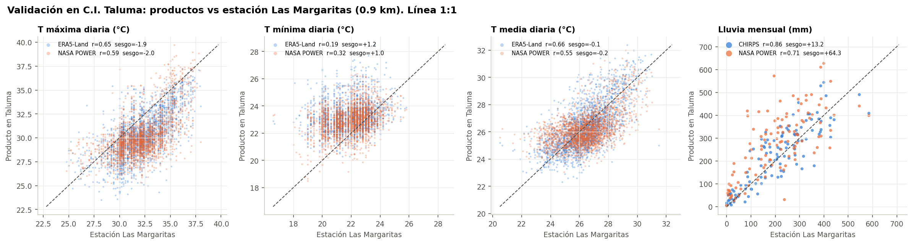

### 5.2 Validación de las horas con HR ≥ 90 %
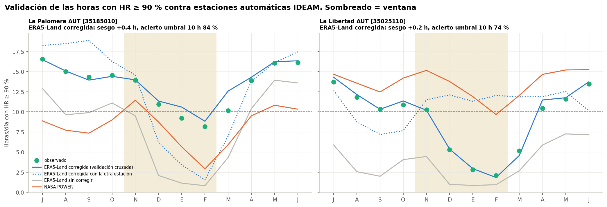

Las dos estaciones de referencia son muy distintas en la época seca: en enero, ~9 h/día en La Palomera frente a ~3 h/día en La Libertad. **Una corrección entrenada en una estación no se puede transferir a la otra** (línea punteada en la figura).

### 5.3 Comparación entre sitios
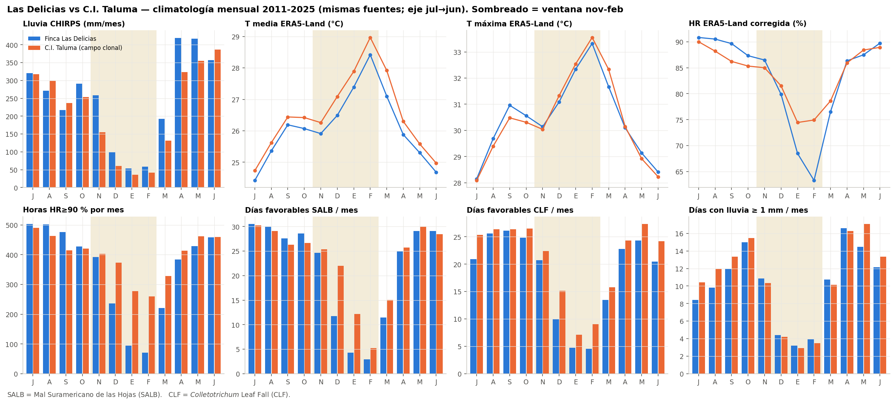
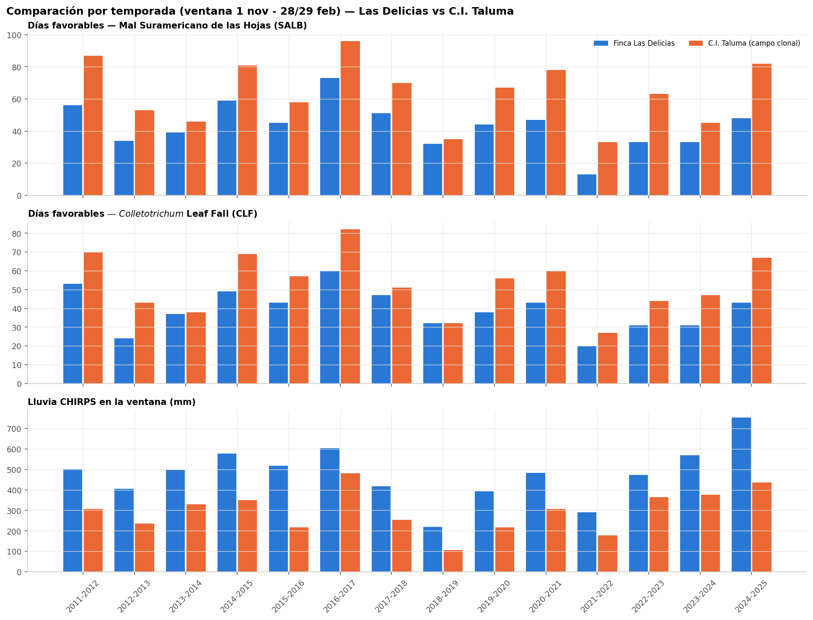

- **Temperatura:** casi igual en ambos sitios.
- **Lluvia:** Taluma recibe menos lluvia en la ventana.
- **Humedad:** la comparación **depende de la estación de referencia de HR** (figura siguiente). Esta es la principal incertidumbre del estudio.

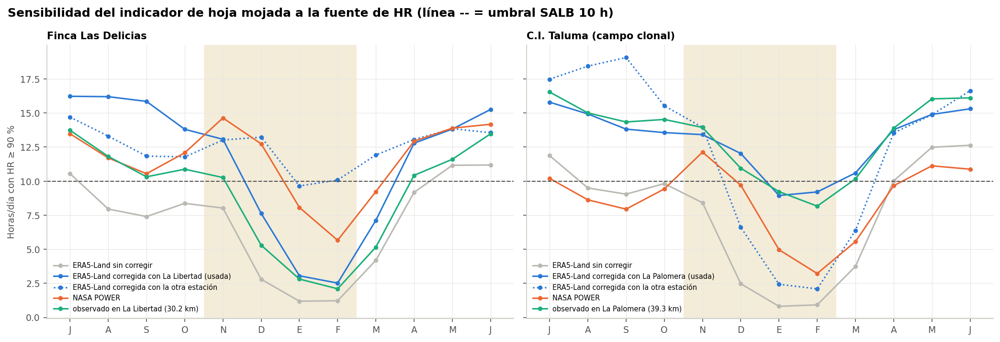

### 5.4 Medias móviles de 3 y 7 días
La MA3 reduce la variación día a día en ~55-60 % y conserva eventos cortos de 2-3 noches húmedas. La MA7 la reduce en ~75-80 % y muestra el régimen de fondo de la semana.

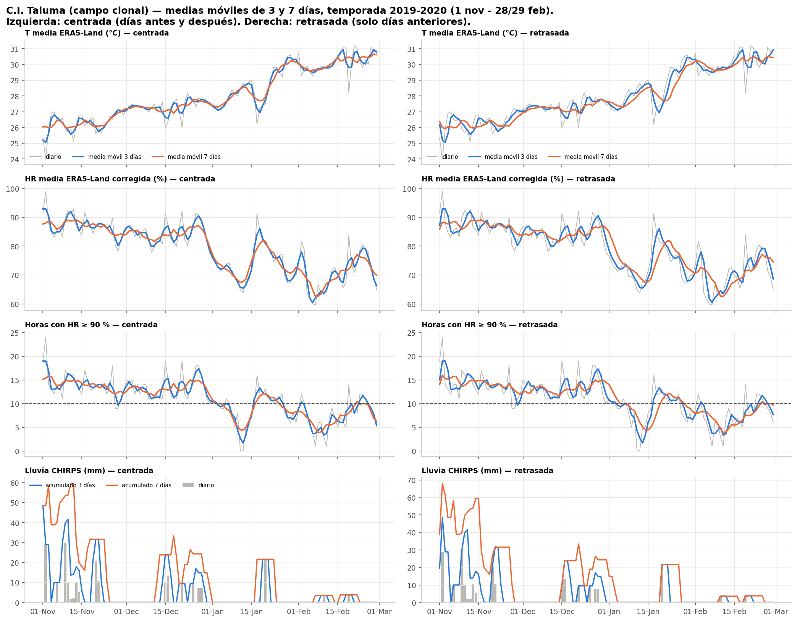
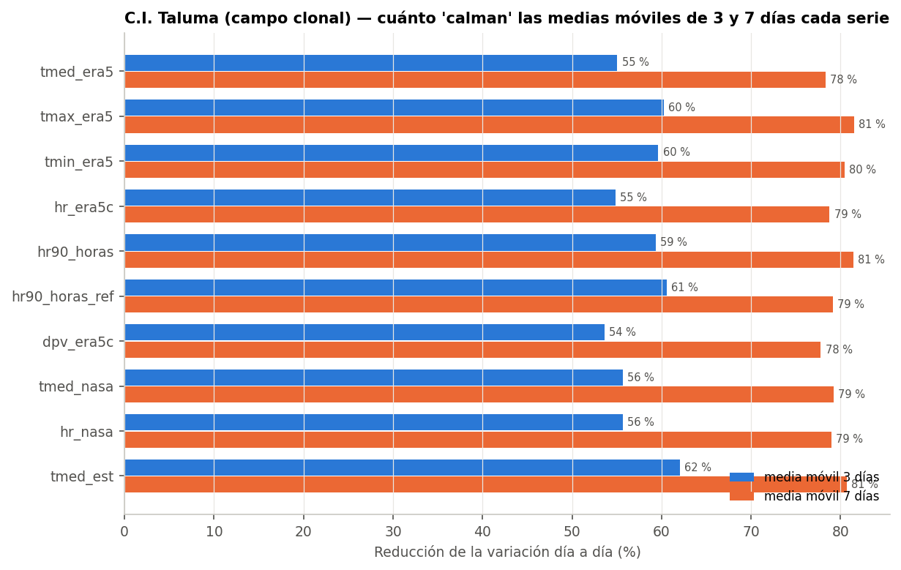

### 5.5 Panel por temporada (una figura por temporada y por sitio en `04_temporadas/`)
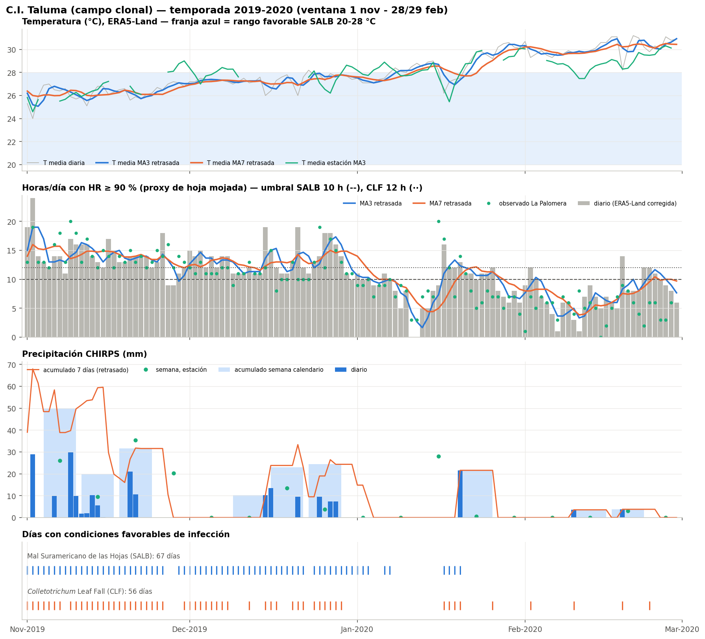

### 5.6 Variabilidad dentro de la ventana y entre años
En noviembre casi todos los días son favorables. La caída más fuerte ocurre entre enero y febrero, en plena época seca.

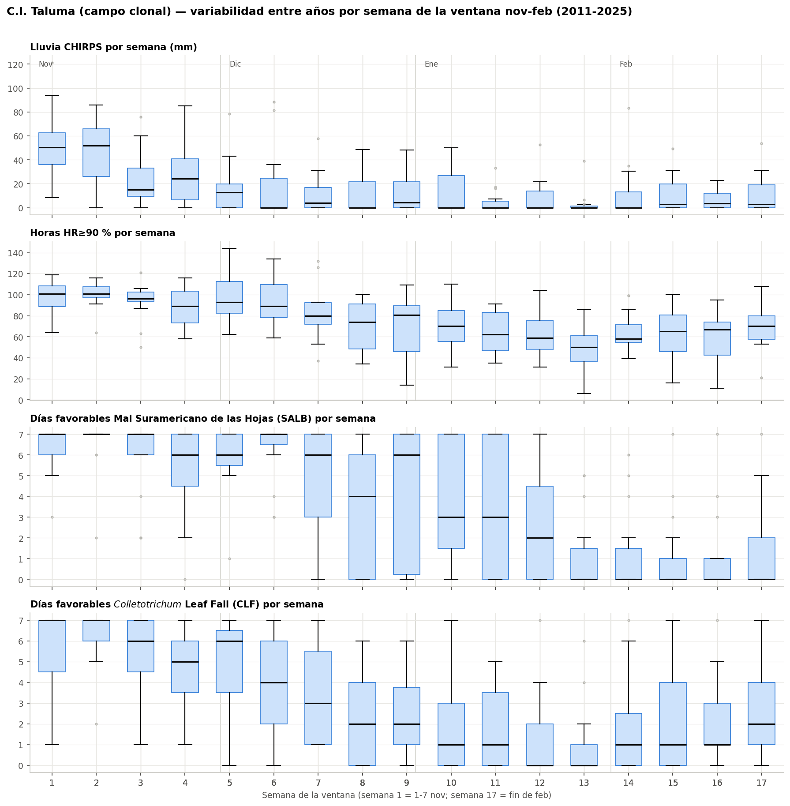
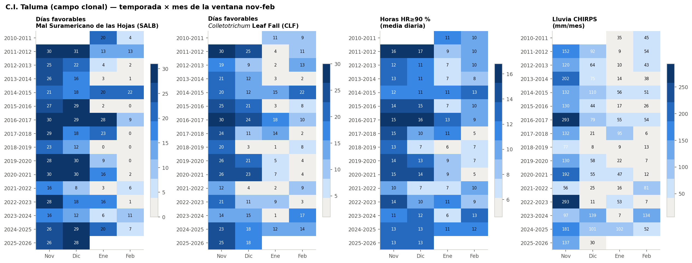
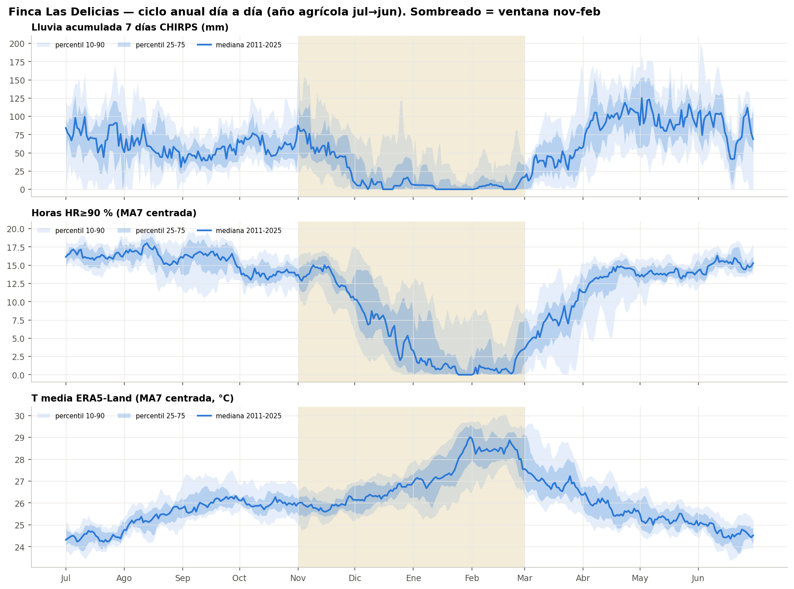

### Lista completa de figuras
| Carpeta | Figuras |
|---|---|
| `resultados/figuras/<sitio>/` | `01` series mensuales · `02` climatología · `05` semanas de la ventana · `06` mapas de calor temporada × mes · `07` ciclo anual diario · `08` efecto de las medias móviles |
| `resultados/figuras/<sitio>/04_temporadas/` | `temporada_<año>.png` (panel T, HR, lluvia y días favorables) y `medias_moviles_<año>.png` (MA3 y MA7, centrada y retrasada) |
| `resultados/figuras/comparacion/` | `C1` validación T/lluvia · `C1b` validación horas HR ≥ 90 % · `C2` climatología · `C3` temporadas · `C4` sensibilidad a la fuente de HR |

### Tablas (Excel)
- `resultados/<sitio>/Base_climatica_<sitio>.xlsx`: datos diarios, medias móviles, ventanas de rezago, semanal, mensual, climatología, anomalías y temporadas. La hoja **LEEME** describe cada columna.
- `resultados/Comparacion_sitios.xlsx`: distancias, validaciones, sesgos de HR, sensibilidad y comparación entre sitios.

## 6. Cómo ejecutar

```bash
pip install -r requirements.txt
python scripts/descargar_chirps.py      # lluvia CHIRPS de los sitios (~15 min, solo la primera vez)
python scripts/descargar_ideam_aut.py   # HR horaria de La Palomera y La Libertad (datos.gov.co)
python scripts/analisis_clima.py        # análisis completo: Excel + figuras
```

- Los datos ya descargados están en `datos_crudos/`, así que basta con el último comando.
- Los parámetros (sitios, ventana, umbrales, medias móviles, estaciones de referencia) se cambian en [`scripts/config.py`](scripts/config.py).
- Para incorporar AgERA5 e IMERG:
  1. Ejecute [`scripts/gee_agera5_imerg.js`](scripts/gee_agera5_imerg.js) en Google Earth Engine.
  2. Copie los 8 CSV a `datos_crudos/gee/`.
  3. Vuelva a correr el análisis.

## 7. Estructura del repositorio

```
├── README.md, GUIA_ANALISIS.md
├── Climate SCG (ERA 5 Land & CHIRPS).csv    # datos originales Las Delicias
├── Dhime *.xlsx                             # datos originales IDEAM (DHIME)
├── scripts/
│   ├── config.py                # parámetros
│   ├── analisis_clima.py        # flujo principal
│   ├── cargar_datos.py          # lectura y limpieza de fuentes
│   ├── humedad.py               # corrección y validación de HR horaria
│   ├── graficos.py              # figuras
│   ├── descargar_chirps.py      # CHIRPS por punto (lectura HTTP de COG)
│   ├── descargar_ideam_aut.py   # estaciones automáticas IDEAM (datos.gov.co)
│   ├── gee_agera5_imerg.js      # AgERA5 + IMERG en Earth Engine
│   └── gee_exportar_sitios.js   # ERA5-Land + CHIRPS en Earth Engine (alternativa)
├── datos_crudos/<sitio|estación>/  # descargas: NASA POWER, ERA5-Land, CHIRPS, IDEAM AUT
└── resultados/                      # Excel y figuras
```

## 8. Sugerencia para consultar con el equipo: sensores en campo

> **Propuesta para discutir con el equipo antes de decidir.**

La mayor incertidumbre del estudio es la humedad nocturna en cada sitio:
- Las estaciones de referencia están a 30-39 km y difieren mucho entre sí.
- Los productos satelitales y de reanálisis no resuelven esa escala.

Para reducir esa incertidumbre se sugiere evaluar, con el equipo técnico de AGROSAVIA y de la finca:

1. **Sensor de mojadura foliar** (tipo placa dieléctrica) dentro del dosel del campo clonal de Taluma y de un lote de Las Delicias. Mide directamente las horas de hoja mojada, la variable que controla la infección de SALB.
2. **Termohigrómetro con registrador** (HR y T cada 10-15 min, con protector de radiación) en cada sitio, a 1.5-2 m y, si es posible, también dentro del dosel.
3. **Pluviómetro de balancín** en Las Delicias, o en su defecto la descarga de los pluviómetros IDEAM cercanos (Santa Helena, El Toro, Yaguarito).

Con **una sola temporada** (nov-feb) de registros se podría:
- Validar la corrección de la HR de ERA5-Land en el propio sitio.
- Recalibrar el umbral de horas de mojadura.
- Reconstruir la serie histórica 2011-2025 con mayor confianza.

## 9. Pendientes y contexto para continuar

Estado al 7 de octubre de 2026. Lo que falta, en orden de prioridad:

| # | Pendiente | Quién / cómo | Por qué importa |
|---|---|---|---|
| 1 | **Datos de enfermedad**: incidencia y severidad de SALB y CLF por clon y fecha, en ambos sitios | Equipo de campo | Sin ellos no se puede calcular qué ventana de clima (3-30 días, MA3/MA7) explica la enfermedad (correlación de Spearman con `ventanas_moviles`) |
| 2 | **Fenología**: fechas de defoliación (*wintering*) y refoliación por año y sitio | Equipo de campo | El riesgo de SALB depende de que la refoliación coincida con condiciones húmedas |
| 3 | **Hoja "SALVI / Colletotrichum"** con las ventanas de interés definidas por el equipo | Equipo | Hoy se usan umbrales de la literatura (`scripts/config.py`) |
| 4 | **AgERA5 e IMERG** | Ejecutar `scripts/gee_agera5_imerg.js` en Earth Engine y copiar los CSV a `datos_crudos/gee/` | Segunda fuente de HR (horas fijas) y lluvia por hora |
| 5 | **Pluviómetros IDEAM cerca de Las Delicias** (Santa Helena 2.1 km, El Toro 7.3 km, Yaguarito 7.4 km), precipitación diaria 2011-2025 | Descargar de DHIME | Validar CHIRPS en la propia finca |
| 6 | **Revisar la T mínima de Las Margaritas** | Consultar con IDEAM o AGROSAVIA | Casi no se correlaciona con ningún producto |
| 7 | **Índice ONI (El Niño / La Niña)** | NOAA | Explicar la variación entre temporadas (2015-16 seco; 2016-17 y 2024-25 húmedos) |
| 8 | **Sensores en campo** (sección 8) | Decisión del equipo | Reducir la incertidumbre de la HR nocturna |

Decisiones ya tomadas, para no repetir la discusión:
- **Ventana:** continua del 1 nov al 28/29 feb. Mayo y marzo quedan fuera.
- **Medias móviles:** de 3 y 7 días, centrada y retrasada.
- **HR:** la de Taluma se corrige con La Palomera y la de Las Delicias con La Libertad, que son las estaciones más cercanas. La corrección cruzada se reporta como sensibilidad (`_alt`).
- **Nombres:** "Mal Suramericano de las Hojas (SALB)" y "*Colletotrichum* Leaf Fall (CLF)". Solo el género va en cursiva.

---
*Datos: IDEAM (DHIME y datos.gov.co), UCSB-CHC (CHIRPS), ECMWF/Copernicus (ERA5-Land, vía Open-Meteo), NASA POWER.*
